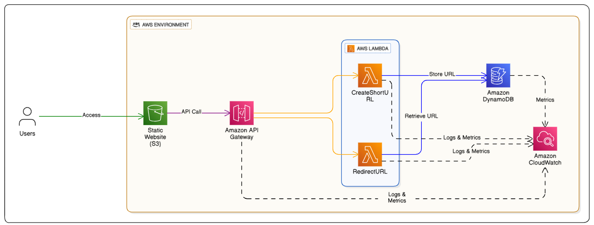
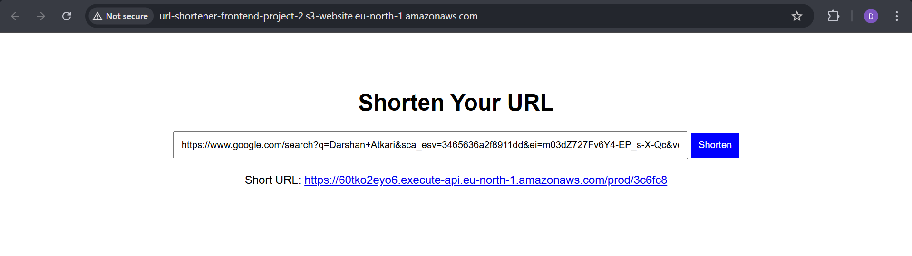
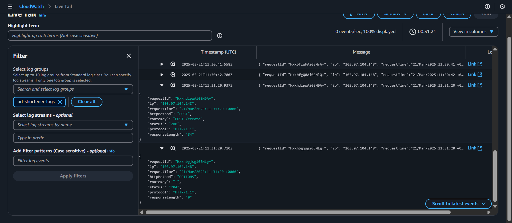
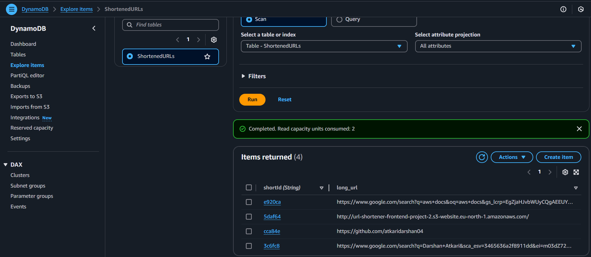

#  AWS Serverless Architecture for URL Shortener Application

## Project Overview
This project builds a serverless URL shortener using AWS services. Instead of using a traditional backend server, it leverages AWS Lambda, API Gateway, DynamoDB, S3, and CloudWatch to create a highly scalable, secure, and cost-effective solution. The frontend is hosted using S3 static website hosting, while API Gateway handles requests to generate and retrieve short URLs. DynamoDB acts as the database for storing URL mappings, and Lambda functions provide the backend logic to process requests. Additionally, CloudWatch is set up to monitor logs and track API requests for debugging and analysis.

## Architecture

## How It Works
1. **User submits a long URL** through a web frontend.
2. **API Gateway** triggers a **Lambda function**, which:
   - Generates a unique short code for the URL.
   - Stores the mapping (`short-code → long URL`) in **DynamoDB**.
3. When a user visits the short URL:
   - Another **Lambda function** retrieves the long URL from DynamoDB.
   - Redirects the user to the original URL.
4. A simple **frontend hosted on S3** provides an interface to generate and manage short links.
5. **CloudWatch** is used to log API requests, Lambda executions, and errors for monitoring and debugging.

## Tech Stack
- **AWS S3** – Hosts the frontend.
- **AWS API Gateway** – Handles API requests.
- **AWS Lambda** – Executes backend logic for URL creation and redirection.
- **AWS DynamoDB** – Stores short URLs and their corresponding long URLs.
- **AWS IAM** – Manages access control and permissions.
- **AWS CloudWatch** – Monitors API Gateway logs.

## Application Overview

## Start Here

Pick one of the deployment guides:

* **[Deploy with AWS Console](./docs/console.md)**
* **[Deploy with Terraform](./docs/terraform.md)**

---