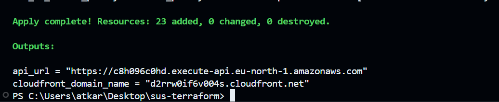
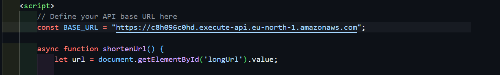
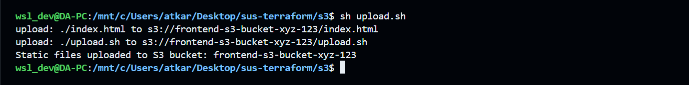
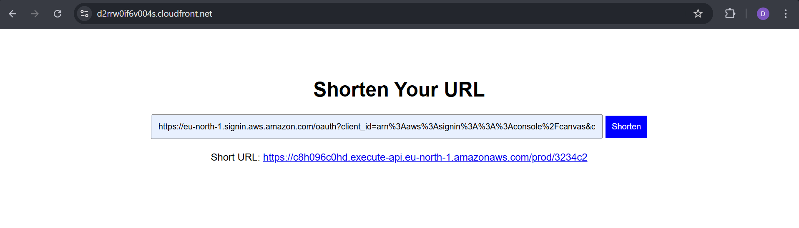

#  Deploying Using Terraform

### 1️⃣ Initialize Terraform
```bash
terraform init
```

### 2️⃣ Validate & Plan the Deployment
```bash
terraform validate
terraform plan
```

### 3️⃣ Deploy the Infrastructure
```bash
terraform apply
```




## ✅ Post Deployment Steps

### 🔁 1. Update `api_url` in Frontend

After deployment, copy the **API Gateway URL** from Terraform output and replace the value of `api_url` in your `index.html`.



---

### ☁️ 2. Upload Frontend to S3

Upload the updated frontend file to the S3 bucket:
```bash
cd s3
sh upload.sh
```

> Example:



### 🌐 3. Access the Web App

Grab the **CloudFront CDN domain** from the Terraform output and open it in your browser.

> Example:



## 🔥 Clean Up Resources

When you're done and want to remove all resources:
```bash
terraform destroy --auto-approve
```

---
